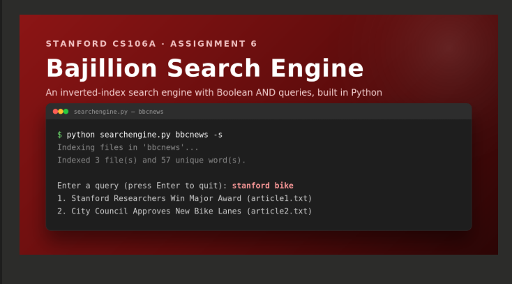
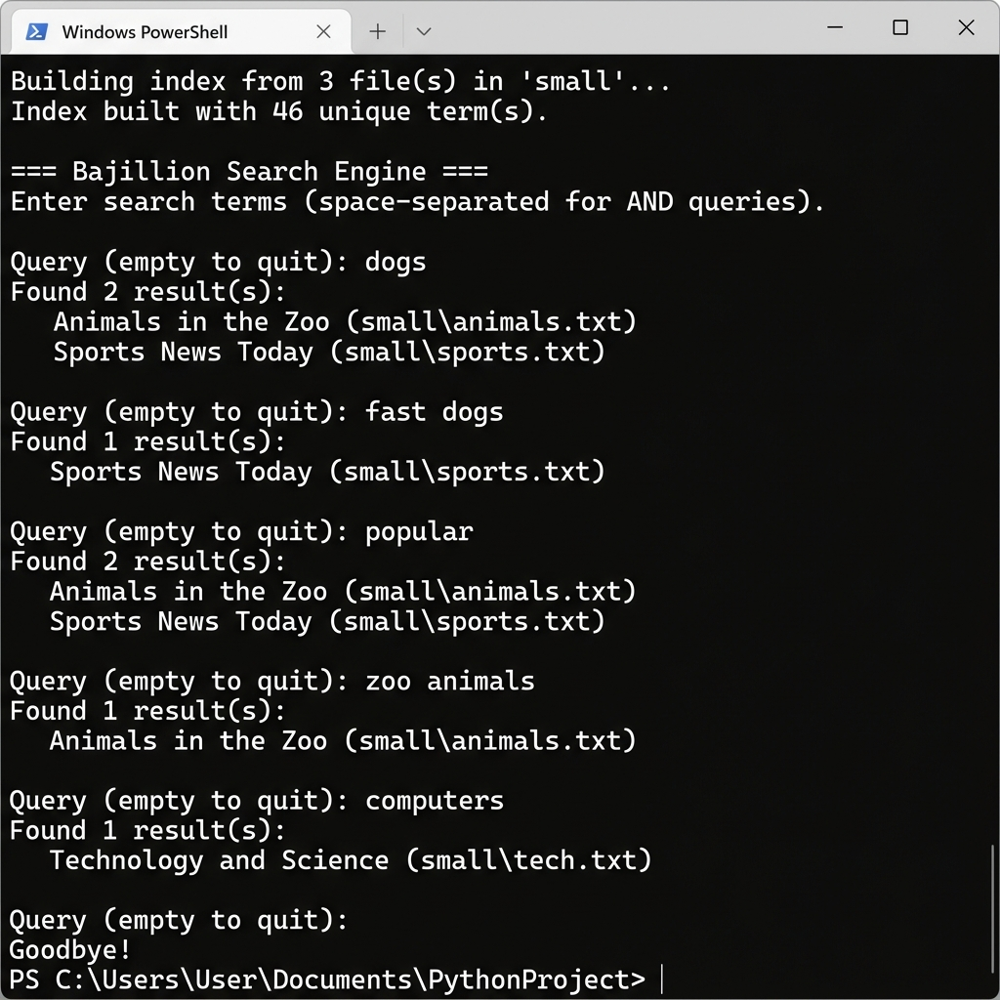

# Bajillion Search Engine 🔍



**Stanford CS106A – Assignment 6**

A simple search engine that builds an inverted index from a collection of text files and supports interactive Boolean AND queries.

## Screenshots

### Interactive Search


## Files

| File | Description |
|------|-------------|
| `common_elements.py` | Utility function to find common elements between two lists |
| `searchengine.py` | Main search engine: index builder, search, and CLI |
| `ethics.txt` | Answers to the assignment's ethics questions |
| `small/` | Sample dataset with 3 `.txt` files for testing |

## Usage

### Build and print the index
```bash
python searchengine.py small
```

### Interactive search mode
```bash
python searchengine.py small -s
```

### Example session
```
Building index from 3 file(s) in 'small'...
Index built with 46 unique term(s).

=== Bajillion Search Engine ===
Enter search terms (space-separated for AND queries).

Query (empty to quit): dogs
Found 2 result(s):
  Animals in the Zoo (small\animals.txt)
  Sports News Today (small\sports.txt)

Query (empty to quit): fast dogs
Found 1 result(s):
  Sports News Today (small\sports.txt)
```

## How It Works

1. **Indexing**: Reads `.txt` files from a directory. The first line of each file is treated as the title. Remaining content is tokenized, cleaned (punctuation stripped, lowercased), and added to an inverted index mapping terms → filenames.

2. **Searching**: Splits the query into terms, retrieves the matching file list for each term, and intersects them (Boolean AND) to return only files containing ALL query terms.

## Requirements

- Python 3.6+
- No external dependencies (uses only `os`, `sys`, `string`)
